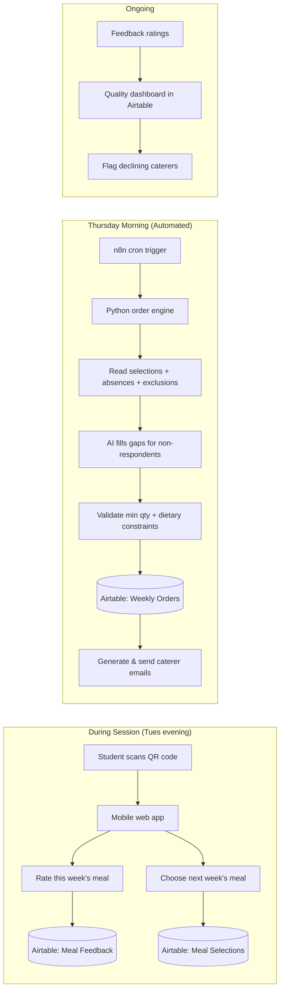
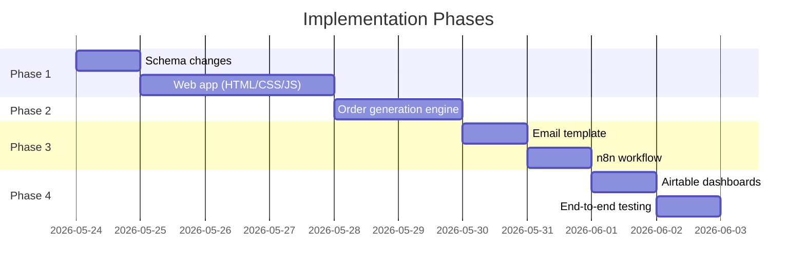

# Automating Padea's Catering Pipeline

The catering ordering process is a manual bottleneck: the program coordinator guesses at meals every Thursday, students are unhappy with selections, and food quality goes unmonitored. This plan replaces that with a data-driven, largely automated system where **students choose their own meals** and **AI compiles and sends weekly orders**.

## System Overview



---

## User Review Required

> [!IMPORTANT]
> **Meal selection deadline.** The plan assumes students select meals during their session (i.e. Tuesday dinner break for the following week). Students who don't respond by Wednesday midnight get an AI-assigned meal. Is this timing acceptable, or should there be a longer window (e.g. open from Tuesday to Wednesday evening)?

> [!IMPORTANT]
> **QR code delivery method.** The plan has on-site managers displaying a printed/projected QR code during dinner. An alternative is texting a link to each student's phone. Which is preferred?

> [!WARNING]
> **Non-respondent handling.** When a student doesn't select a meal, the AI will pick one based on their dietary requirements and prior ratings. An alternative is to simply exclude them from the order and not provide a meal. Which approach?

> [!IMPORTANT]
> **Caterer email format.** Currently the coordinator sends a free-form email. Should the automated email match the existing format, or can we redesign it? The plan proposes a clean, structured format (see Phase 3).

## Open Questions

1. **How many menu items per caterer should each order include?** The caterers have "Min Qty for 4/5/6 items" fields — does the coordinator currently aim for a fixed number of distinct items (e.g. always 5), or does it vary?

2. **Do caterers ever change mid-term?** The `Sessions` table links each session to a caterer. If a caterer's quality declines mid-term, is swapping them out in scope for this automation, or is that still a manual decision?

3. **Is there a per-meal budget cap?** Lakehouse is $35/item while Kenko is $5.50/item — is there a maximum the business will pay per student per meal?

4. **n8n hosting.** Is n8n already deployed somewhere (self-hosted, cloud), or does it need to be set up? The plan assumes a self-hosted n8n instance accessible at a local URL.

5. **Email sending.** What email service should caterer order emails be sent from? Options: Gmail (via n8n Gmail node), SMTP relay, or a dedicated transactional service like Resend/SendGrid.

6. **Web app hosting.** The student QR-code page is a lightweight static site. Where should it be hosted? Options: Vercel (free tier, zero config), GitHub Pages, or a subdomain on an existing Padea server.

---

## Proposed Changes

### Phase 1: Student Meal Selection & Feedback (QR Code Web App)

A mobile-first web page that students access by scanning a QR code during their meal break. No login required — the session context is encoded in the QR URL.

#### How the QR code works

Each session gets a unique URL like:
```
https://meals.padea.com.au/s/{session_airtable_id}
```

The on-site manager displays this QR code (printed sheet or projected). When a student scans it, the web app:
1. Looks up the session → school → caterer → menu items
2. Shows the student list for that session (students tap their name — no login friction)
3. Presents two actions: **rate today's meal** and **choose next week's meal**

---

#### [NEW] `webapp/index.html`

Single-page application shell. Mobile-first responsive design with the following screens:

1. **Student picker** — list of students enrolled in this session; student taps their name
2. **Rate this meal** — shows today's menu items; student taps a 1–5 star rating + optional comment
3. **Pick next week's meal** — shows next week's caterer menu items (filtered by dietary compatibility); student picks one item

Key design decisions:
- **No authentication.** This is a low-stakes, in-person interaction. A student picking their own name is sufficient. The on-site manager is present to prevent abuse.
- **Dietary filtering.** Menu items that violate a student's dietary requirements are hidden (e.g. a Halal student won't see pork items). A student with "No Beef, No Pork" will only see items tagged as compatible.
- **One selection per student per session.** If a student re-scans and re-selects, the old selection is overwritten (upsert).

#### [NEW] `webapp/style.css`

Mobile-first styles with warm, premium aesthetic (Padea brand colors). Dark card-on-light layout with smooth animations.

#### [NEW] `webapp/app.js`

Frontend logic:
- Fetches session data from Airtable REST API (read-only, scoped API key)
- Submits feedback/selections to Airtable via POST (write-scoped key, restricted to Meal Feedback / Meal Selections tables)
- Client-side dietary filtering logic
- Implements the upsert pattern: before creating a new Meal Selection, checks if one already exists for this student + session, and updates it if so

---

### Phase 2: AI Order Generation Engine

A Python script that runs every Thursday morning. It compiles student selections, handles edge cases, and produces a finalized order for each caterer.

#### [NEW] `scripts/generate_orders.py`

Main order generation pipeline:

```
1. Determine "next week" date range (Mon–Fri of the following week)
2. For each session next week:
   a. Get enrolled students (from Students table, linked via Sessions)
   b. Subtract absences (from Absences table) and exclusions (from Exclusions table)
   c. Get meal selections (from Meal Selections table for this session)
   d. For students who DID select: validate dietary compatibility
   e. For students who DID NOT select: AI assigns a meal using:
      - Student's dietary requirements (hard filter)
      - Student's past ratings (soft preference — pick highest-rated compatible item)
      - Variety (avoid repeating last week's meal)
   f. Aggregate selections per caterer across all sessions the caterer serves that week
   g. Validate against minimum order quantities (Min Qty 4/5/6 Items)
   h. If minimum not met: consolidate to fewer distinct items until minimum is satisfied
3. Write finalized orders to Airtable (Weekly Orders + Order Line Items tables)
```

Key logic:

- **Dietary compatibility check:** A menu item is compatible with a student if:
  - Item's `Dietary Tags` ⊇ student's positive requirements (Gluten Free, Dairy Free, Nut Free, Vegetarian, Halal)
  - Item doesn't contain ingredients excluded by student's negative requirements (No Beef → skip items with "beef" in name, etc.)
  
- **AI gap-filling (for non-respondents):** Uses a scoring function:
  ```
  score(item, student) = 
      avg_rating(item, student)     * 0.5    # personal history
    + avg_rating(item, all_students) * 0.3    # popularity
    - was_served_last_week(item)     * 0.2    # variety penalty
  ```
  Falls back to random-from-compatible if no rating history exists.

- **Minimum order quantity enforcement:** If a caterer's total order across all schools for the week is below the minimum for the selected number of distinct items, the engine:
  1. Merges the least-popular items into the most-popular ones
  2. Reduces distinct items until the threshold is met (e.g. from 6 items to 5, checking Min Qty 5)

---

#### [MODIFY] [schema.py](file:///home/daniel/Downloads/Padea/scripts/schema.py)

Add two new tables to `TABLES_SCHEMA`:

**`Weekly Orders`** — one record per caterer per week:
| Field | Type | Notes |
|-------|------|-------|
| Order ID | singleLineText (primary) | e.g. "Lakehouse VP — 2026-W19" |
| Caterer | multipleRecordLinks → Caterers | |
| Week Start | date | Monday of that week |
| Total Meals | number | Sum of all line items |
| Total Cost | currency | Calculated from line items |
| Status | singleSelect | Draft / Sent / Confirmed / Delivered |
| Email Sent At | dateTime | When the order email was dispatched |
| Notes | multilineText | Any special instructions |

**`Order Line Items`** — one record per menu item per order:
| Field | Type | Notes |
|-------|------|-------|
| Line Item ID | singleLineText (primary) | e.g. "Lakehouse VP — W19 — Shrimp Fried Rice" |
| Weekly Order | multipleRecordLinks → Weekly Orders | |
| Menu Item | multipleRecordLinks → Menu Items | |
| Quantity | number | How many of this item to order |
| School Breakdown | multilineText | JSON or text: "MBBC: 3, CHAC: 2" |

Also add a **`Last Served Menu Item`** link field to `Meal Selections` to support the variety penalty.

---

### Phase 3: Automated Caterer Email (n8n + Python)

An n8n workflow triggered every Thursday at 9:00 AM that generates and sends order emails.

#### [NEW] `n8n/order_email_workflow.json`

n8n workflow definition (importable):

```
1. Cron Trigger: Thursday 09:00 AEST
2. HTTP Request node → calls Python order engine endpoint (or runs it inline via Execute Command node)
3. Airtable node → reads Weekly Orders where Status = "Draft" and Week Start = next Monday
4. For each Weekly Order:
   a. Airtable node → reads linked Order Line Items
   b. Airtable node → reads linked Caterer (for contact email, chef CC preference)
   c. Airtable node → reads linked Sessions (for school, day, delivery time, building, on-site manager + mobile)
   d. Function node → formats the email body (HTML template)
   e. Email node → sends to Contact Email, CC Chef Email if Chef Wants CC = true
   f. Airtable node → updates Weekly Order: Status = "Sent", Email Sent At = now
```

#### [NEW] `templates/order_email.html`

HTML email template. Example output:

```
Subject: Padea Meal Order — Week of 4 May 2026

Hi Carmen,

Here is the meal order for Lakehouse Victoria Point for the week of 4 May:

┌─────────────────────────────────────────────────┐
│ MONDAY — Moreton Bay Boys' College              │
│ Deliver by: 5:50 PM                             │
│ Building: S Block, Room S2.4                    │
│ On-site manager: Sarah (0412 345 678)           │
│                                                 │
│  Shrimp Fried Rice ............... ×4            │
│  Sweet & Sour Chicken ........... ×3             │
│  Korean Beef Bulgogi ............ ×2             │
│                                                 │
│ TOTAL: 9 meals                                  │
└─────────────────────────────────────────────────┘

┌─────────────────────────────────────────────────┐
│ WEDNESDAY — Cannon Hill Anglican College         │
│ ...                                             │
└─────────────────────────────────────────────────┘

GRAND TOTAL: 17 meals
Delivery fee: $0.00 (2 trips × $0)

Thanks,
Padea
```

#### [NEW] `scripts/send_orders.py`

Standalone script that can also be invoked manually (outside n8n) for testing. Reads Draft orders from Airtable, formats emails using the template, and sends via SMTP/API.

---

### Phase 4: Feedback-Driven Quality Monitoring

No new code required — this is an Airtable view/dashboard configuration:

- **Caterer Quality Score** — a formula field on the Caterers table: average of all Meal Feedback ratings for items from that caterer in the last 4 weeks
- **Trending Down alert** — an Airtable automation that sends a Slack/email notification to the program coordinator if a caterer's rolling average drops below 3.0
- **Per-item popularity** — a rollup on Menu Items counting total selections and average rating, so the order engine and coordinator can see which items students actually want

---

## File Summary

| File | Status | Purpose |
|------|--------|---------|
| `scripts/schema.py` | MODIFY | Add Weekly Orders + Order Line Items tables |
| `scripts/generate_orders.py` | NEW | Thursday order compilation engine |
| `scripts/send_orders.py` | NEW | Email formatting and dispatch |
| `webapp/index.html` | NEW | Student QR code landing page |
| `webapp/style.css` | NEW | Mobile-first styles |
| `webapp/app.js` | NEW | Frontend logic (Airtable API integration) |
| `n8n/order_email_workflow.json` | NEW | Importable n8n workflow |
| `templates/order_email.html` | NEW | Caterer email HTML template |

---

## Verification Plan

### Automated Tests

1. **Schema sync** — `./run schema update` succeeds and creates the two new tables
2. **Order generation dry-run** — `python scripts/generate_orders.py --dry-run` against current Airtable data, confirming:
   - Correct student counts after subtracting absences/exclusions
   - Dietary filtering produces only compatible items
   - Minimum order quantities are respected
   - Output matches expected Weekly Order / Line Item format
3. **Email template rendering** — `python scripts/send_orders.py --preview` generates HTML email for each caterer without sending
4. **Web app smoke test** — open `webapp/index.html` in browser, verify student list loads, meal selection submits to Airtable

### Manual Verification

1. **End-to-end walkthrough** — simulate a full cycle:
   - Scan QR code → select meal → run order engine → preview email → send test email to coordinator
2. **Caterer email review** — program coordinator reviews a generated email side-by-side with one they wrote manually, confirming all necessary information is present
3. **On-site manager test** — display QR code at one session, have students actually use it, review resulting Airtable data

---

## Implementation Order


