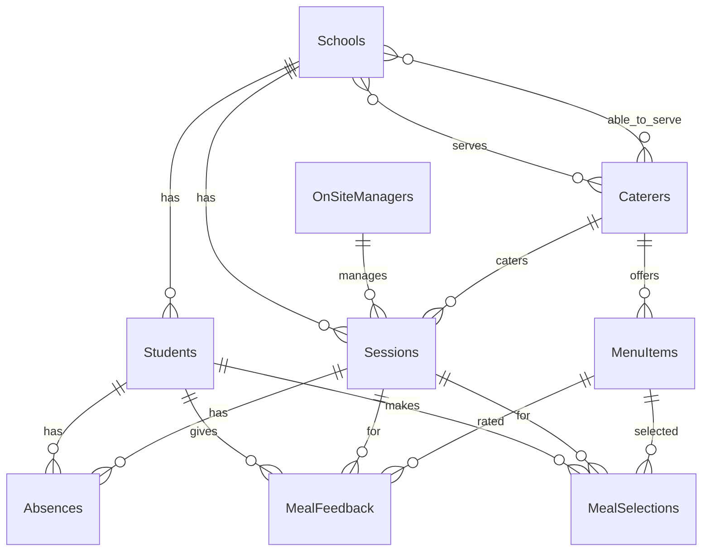

# Implementation Plan - Migrating Padea Data to Airtable

This plan outlines the strategy to profile and migrate Padea's tutoring session and catering data from unstructured/tabular resources to a robust, fully relational Airtable database.

## User Review Required

> [!IMPORTANT]
> **Key Database Schema Decisions:**
> 1. We designed a fully normalized relational schema instead of blindly duplicating spreadsheets.
> 2. Added **Schools** and **On-Site Managers** as independent tables to model relationships properly.
> 3. Added **Meal Feedback** (1-5 star ratings) and **Meal Selections** tables to support future business capabilities.
> 4. To handle circular linking dependencies during schema creation, our `update_schema.py` script will create all tables with only their primary key fields first, and then add all remaining fields (including record links).

## Proposed Relational Schema

Below is the structured, normalized schema for the Airtable database:

### Table Details

1. **Schools**
   - `School Name` (Primary, `singleLineText`)
   - `Region` (`singleSelect`: Redlands, South Brisbane, West Brisbane, Central Brisbane)
   - `Sessions` (`multipleRecordLinks` to Sessions)
   - `Students` (`multipleRecordLinks` to Students)
   - `Serves Schools` (`multipleRecordLinks` to Caterers)
   - `Able to Serve Schools` (`multipleRecordLinks` to Caterers)

2. **On-Site Managers**
   - `Manager Name` (Primary, `singleLineText`)
   - `Mobile` (`phoneNumber`)
   - `Sessions` (`multipleRecordLinks` to Sessions)

3. **Caterers**
   - `Caterer Name` (Primary, `singleLineText`)
   - `Region` (`singleSelect`: Redlands, South Brisbane, West Brisbane, Central Brisbane)
   - `Min Qty 4 Items` (`number`, integer)
   - `Min Qty 5 Items` (`number`, integer)
   - `Min Qty 6 Items` (`number`, integer)
   - `Contact Name` (`singleLineText`)
   - `Contact Email` (`email`)
   - `Chef Name` (`singleLineText`)
   - `Chef Email` (`email`)
   - `Chef Wants CC` (`checkbox`)
   - `Delivery Fee` (`currency`)
   - `Delivery Fee Structure` (`singleSelect`: Per trip, Per school per trip)
   - `Price Includes GST` (`checkbox`)
   - `Notes` (`longText`)
   - `Serves Schools` (`multipleRecordLinks` to Schools)
   - `Able to Serve Schools` (`multipleRecordLinks` to Schools)

4. **Menu Items**
   - `Menu Item Name` (Primary, `singleLineText`)
   - `Caterer` (`multipleRecordLinks` to Caterers)
   - `Price` (`currency`)
   - `Dietary Tags` (`multipleSelects`: Gluten Free, Dairy Free, Nut Free, Vegetarian, Halal)
   - `Notes` (`longText`)

5. **Students**
   - `Student Name` (Primary, `singleLineText`)
   - `Year Level` (`number`, integer)
   - `Subjects` (`singleLineText`)
   - `Dietary Requirements` (`multipleSelects`: Dairy Free, Gluten Free, Nut Free, Vegetarian, Halal, No Beef, No Pork, No Seafood, No Shellfish, No Fish, No Red Meat, Opted out of Catering)
   - `Student Email` (`email`)
   - `Parent Name` (`singleLineText`)
   - `Parent Email` (`email`)
   - `Parent Mobile` (`phoneNumber`)
   - `Sessions` (`multipleRecordLinks` to Sessions)

6. **Sessions**
   - `Session ID` (Primary, `singleLineText` e.g., "Loreto College - 2026-05-01")
   - `School` (`multipleRecordLinks` to Schools)
   - `Date` (`date`)
   - `Day` (`singleSelect`: Monday, Tuesday, Wednesday, Thursday, Friday)
   - `Caterer` (`multipleRecordLinks` to Caterers)
   - `On-Site Manager` (`multipleRecordLinks` to On-Site Managers)
   - `Start Time` (`singleLineText`)
   - `End Time` (`singleLineText`)
   - `Dinner Time` (`singleLineText`)
   - `Year Levels` (`singleLineText`)
   - `Building` (`singleLineText`)

7. **Absences**
   - `Absence ID` (Primary, `singleLineText`)
   - `Student` (`multipleRecordLinks` to Students)
   - `Session` (`multipleRecordLinks` to Sessions)
   - `Date` (`date`)
   - `Reason` (`singleLineText`)

8. **Exclusions**
   - `Exclusion ID` (Primary, `singleLineText`)
   - `School` (`multipleRecordLinks` to Schools)
   - `Date` (`date`)
   - `Affected Year Levels` (`singleLineText`)
   - `Reason` (`singleLineText`)

9. **Meal Feedback**
   - `Feedback ID` (Primary, `singleLineText`)
   - `Student` (`multipleRecordLinks` to Students)
   - `Session` (`multipleRecordLinks` to Sessions)
   - `Menu Item` (`multipleRecordLinks` to Menu Items)
   - `Rating` (`number`, integer 1-5)
   - `Comment` (`longText`)

10. **Meal Selections**
    - `Selection ID` (Primary, `singleLineText`)
    - `Student` (`multipleRecordLinks` to Students)
    - `Session` (`multipleRecordLinks` to Sessions)
    - `Menu Item` (`multipleRecordLinks` to Menu Items)
    - `Selection Date` (`date`)

---

## Proposed Changes

### Shared Module
#### [NEW] [support.py](file:///home/daniel/Downloads/Padea/scripts/support.py)
This module will provide the central Airtable interface and LLM querying helpers.
- Setup python standard logging (`s.log`).
- Initialize `pyairtable.Api` and provide `get_table(name)`, `airtable_post(name, records)`, and `airtable_get(name, formula)`.
- Implement `clear_table(name)` to allow repeatable clean-slate migrations.
- Implement `ask_llm(prompt)` with Anthropic's Claude API using `CLAUDE_CODE_API_KEY` (with a fallback option to mock/heuristic rules if the key is not defined).

### Schema Update Script
#### [NEW] [update_schema.py](file:///home/daniel/Downloads/Padea/scripts/update_schema.py)
This script implements our schema creation using `pyairtable`.
1. Delete any existing database tables to guarantee a clean starting state.
2. Create all 10 tables with only their primary key fields.
3. Add all remaining fields (including standard and `multipleRecordLinks` relational fields) now that all target table IDs are known.

### Migration Scripts
We will rewrite all 7 migration scripts under `migrations/*.py` to map files to the new schema and ensure anomaly checking.
Each script will also support an LLM-free fallback heuristic so that migrations can run and be validated successfully even before `CLAUDE_CODE_API_KEY` is added to `.env`.

#### [MODIFY] [caterers.py](file:///home/daniel/Downloads/Padea/migrations/caterers.py)
- Read `resources/caterers.xlsx`.
- Normalize school names and regions.
- Extract regions, create corresponding **Schools** records first (since Schools is a core linked table), then write **Caterers** records.

#### [MODIFY] [caterer_contacts.py](file:///home/daniel/Downloads/Padea/migrations/caterer_contacts.py)
- Parse `cache/caterer-contacts.txt`.
- Collect contacts in a single batch LLM call (or use high-fidelity regex/keyword matching fallback).
- Update the **Caterers** table with contact details, linking them to their corresponding `Serves Schools` and `Able to Serve Schools`.

#### [MODIFY] [caterer_menus.py](file:///home/daniel/Downloads/Padea/migrations/caterer_menus.py)
- Parse `cache/caterer-menus.txt`.
- Extract base prices, GST status, and delivery fees, updating the **Caterers** table.
- Parse individual menu items using a batched LLM call (or heuristic fallback) to populate the **Menu Items** table.
- Implement rule: "Assume all non-pork meals are halal."

#### [MODIFY] [sessions.py](file:///home/daniel/Downloads/Padea/migrations/sessions.py)
- Read `resources/sessions.xlsx`.
- Extract and upsert **On-Site Managers** records.
- Create **Sessions** records, linking to `Schools`, `Caterers`, and `On-Site Managers`.
- Convert dates and times to standard formats.

#### [MODIFY] [students.py](file:///home/daniel/Downloads/Padea/migrations/students.py)
- Read `resources/students.xlsx` iterating over sheets.
- Skip metadata headers properly.
- Find unique dietary strings, batch-translate them to standard tag arrays (cached under `cache/dietary_mappings.json`), or fall back to high-fidelity matching.
- Create **Students** records, linking them to their registered **Sessions** based on School and Day.

#### [MODIFY] [absences.py](file:///home/daniel/Downloads/Padea/migrations/absences.py)
- Parse `cache/absences.txt`.
- Map students and schools/sessions by date.
- Create **Absences** records.

#### [MODIFY] [exclusions.py](file:///home/daniel/Downloads/Padea/migrations/exclusions.py)
- Parse `cache/exclusions.txt`.
- Process all exclusion sentences in a single LLM batch (or regex fallback).
- Create **Exclusions** records.

---

## Verification Plan

### Automated Tests
1. **Schema Check:** Run `python3 scripts/update_schema.py` and confirm all 10 tables are correctly initialized on Airtable.
2. **Migration Run:** Execute `./run migrate all` and check if all resources are extracted, validated, and successfully written to Airtable.
3. **Data Verification:** Use a test script `scripts/verify_migration.py` to query each table on Airtable and check the record counts and relations.
