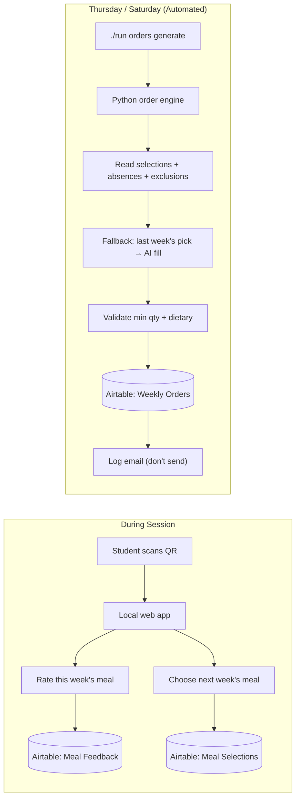

# Automating Padea's Catering Pipeline (Revised)

## Decisions Made

| Topic | Decision |
|-------|----------|
| QR code delivery | Generate QR codes, don't worry about delivery method yet |
| Caterer email | Redesigned format, but **log only** — never actually send |
| Web app hosting | Local static site in `output/` folder, not live |
| Non-respondent fallback | Reuse last week's selection → then week before → then AI-assigned |
| Ordering rounds | **Two rounds**: Mon–Wed orders compiled Thursday, Thu–Fri compiled Saturday |
| Min Qty validation | Total meals ordered from caterer that week must ≥ Min Qty for N distinct items |
| Automation | Pure Python/bash scripts (no n8n dependency) |

## System Overview



---

## Proposed Changes

### Phase 1: Schema Extensions + Order Engine Core

#### [MODIFY] [schema.py](file:///home/daniel/Downloads/Padea/scripts/schema.py)

Add two new tables:

**`Weekly Orders`** — one record per caterer per ordering round:
| Field | Type |
|-------|------|
| Order ID (primary) | singleLineText | e.g. "Lakehouse VP — 2026-W19-R1" |
| Caterer | multipleRecordLinks → Caterers |
| Round | singleSelect: "Round 1 (Mon–Wed)" / "Round 2 (Thu–Fri)" |
| Week Start | date |
| Total Meals | number |
| Total Cost | currency |
| Status | singleSelect: Draft / Sent / Confirmed |
| Notes | multilineText |

**`Order Line Items`** — one record per menu item per school per order:
| Field | Type |
|-------|------|
| Line Item ID (primary) | singleLineText |
| Weekly Order | multipleRecordLinks → Weekly Orders |
| Menu Item | multipleRecordLinks → Menu Items |
| Session | multipleRecordLinks → Sessions |
| Quantity | number |

#### [NEW] `scripts/generate_orders.py`

Core order compilation engine:

```
1. Determine ordering round (R1=Thu for Mon–Wed, R2=Sat for Thu–Fri)
2. Identify target sessions for that round's days
3. For each session:
   a. Get enrolled students (Students linked to this session)
   b. Subtract known absences + exclusions
   c. For each attending student:
      - If they made a Meal Selection for this session → use it
      - Else if they selected a meal in a previous week's equivalent session → reuse it
      - Else → AI assigns (dietary-filtered, rating-weighted)
   d. Validate dietary compatibility of every assignment
4. Aggregate per caterer across all sessions
5. Validate Min Qty: if ordering N distinct items, total meals ≥ Min Qty N Items
   - If not met, merge least-popular items into popular ones and retry with N-1
6. Write Weekly Orders + Order Line Items to Airtable (Status = "Draft")
7. Log the email that *would* be sent to each caterer
```

**Non-respondent fallback logic (detail):**
```python
def resolve_meal(student, session, caterer_menu_items):
    # 1. Explicit selection for this session
    selection = get_selection(student, session)
    if selection: return selection

    # 2. Reuse from previous equivalent session (same school + day)
    for prev_session in get_previous_sessions(session, weeks_back=8):
        prev_sel = get_selection(student, prev_session)
        if prev_sel and prev_sel.menu_item in caterer_menu_items:
            return prev_sel

    # 3. AI assignment
    compatible = filter_dietary(caterer_menu_items, student.dietary)
    return pick_best(compatible, student)  # rating-weighted
```

**Dietary compatibility rules:**
- Positive tags (GF, DF, NF, Vegetarian, Halal): item must have the tag if student requires it
- Negative requirements (No Beef, No Pork, etc.): item name must not contain the excluded ingredient
- "Opted out of Catering": skip student entirely

#### [MODIFY] [run](file:///home/daniel/Downloads/Padea/run)

Add new commands:
```bash
./run orders generate          # compile orders for next round
./run orders generate --dry-run # preview without writing to Airtable
./run orders preview           # show formatted email output
```

---

### Phase 2: Student Web App (Local)

A mobile-first single-page app served locally from `output/webapp/`.

#### [NEW] `output/webapp/index.html`

Screens:
1. **Student picker** — tap your name from the session roster
2. **Rate this meal** — 1–5 stars + optional comment for today's meal
3. **Pick next week** — menu items filtered by dietary compatibility; tap to select

#### [NEW] `output/webapp/style.css`

Premium mobile-first design. Dark cards, warm accent colors, smooth transitions.

#### [NEW] `output/webapp/app.js`

- Reads session context from URL parameter (`?session=rec...`)
- Fetches data from Airtable REST API (read-only key for session/student/menu data)
- Writes Meal Feedback and Meal Selections to Airtable
- Upsert logic: overwrites existing selection for same student + session

#### [NEW] `scripts/generate_qr.py`

Generates a QR code PNG for each session URL. Outputs to `output/qrcodes/`.

---

### Phase 3: Email Formatting & Logging

#### [NEW] `scripts/send_orders.py`

Reads Weekly Orders with Status="Draft" from Airtable. For each:
1. Fetches linked Order Line Items, Caterer, Sessions
2. Formats a structured email body (plain text + HTML)
3. **Logs the email to stdout and to `output/emails/`** — does NOT send
4. Updates order Status to "Sent" in Airtable (to indicate it was processed)

Email format example:
```
Subject: Padea Meal Order — Week of 4 May 2026 (Mon–Wed)

Hi Carmen,

Meal order for Lakehouse Victoria Point:

MONDAY — Moreton Bay Boys' College
  Deliver by: 5:50 PM | Building: S Block, Room S2.4
  On-site manager: Sarah (0412 345 678)

  Shrimp Fried Rice .................. ×4
  Sweet & Sour Chicken ............... ×3
  Korean Beef Bulgogi Rice Bowl ...... ×2
  ─────────────────────────────────────
  Subtotal: 9 meals

GRAND TOTAL: 9 meals | Delivery: $0.00
```

---

## File Summary

| File | Status | Purpose |
|------|--------|---------|
| `scripts/schema.py` | MODIFY | Add Weekly Orders + Order Line Items |
| `scripts/generate_orders.py` | NEW | Order compilation engine |
| `scripts/send_orders.py` | NEW | Email formatting + logging |
| `scripts/generate_qr.py` | NEW | QR code generation |
| `output/webapp/index.html` | NEW | Student meal selection page |
| `output/webapp/style.css` | NEW | Mobile-first styles |
| `output/webapp/app.js` | NEW | Frontend Airtable integration |
| `run` | MODIFY | Add `orders` commands |

## Implementation Order

1. Schema changes → `./run schema update`
2. Order generation engine (+ dry-run testing)
3. Student web app (local)
4. Email formatting + logging
5. QR code generation
6. End-to-end walkthrough

## Verification Plan

1. `./run schema update` — creates Weekly Orders + Order Line Items tables
2. `./run orders generate --dry-run` — validates dietary filtering, min qty, fallback logic
3. `./run orders preview` — shows formatted email for each caterer
4. Open `output/webapp/index.html` in browser — verify student list, selection, feedback flows
5. Manual review of `output/emails/*.txt` against expected format
